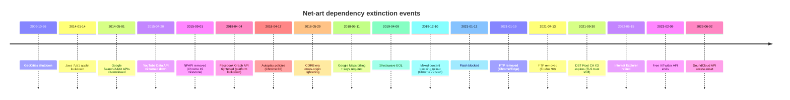

# Net Art Extinction Timeline Seed Report

## Executive summary

This seed research identifies eighteen high‑leverage “extinction events” where a dependency change (browser, plugin/runtime, API, security policy, hosting platform, or protocol) caused net‑artworks to stop functioning as originally published. Four patterns dominate:

Plugin/runtime collapse (Flash, Shockwave, Java applets/NPAPI) caused immediate, high‑severity loss because modern browsers removed the execution environment, not just a feature. citeturn43view0turn43view1  
API enclosure and monetization (X/Twitter, Google Search APIs, YouTube Data API v2, Google Maps Platform billing, SoundCloud resets) tends to produce cascading failure: authentication, quota/rate limits, and app-review constraints break background “live” retrieval and ongoing generative systems. citeturn48search0turn44view1turn44view2turn44view3  
Security hardening in browsers (mixed-content blocking, autoplay restrictions, cross-origin enforcement like CORB and Private Network Access) breaks works that assumed permissive defaults for loading remote media or cross‑origin data. citeturn45view0turn45view1turn46view1turn46view2  
Infrastructure fragility (GeoCities shutdown, domain/hosting lapses, FTP removal, TLS trust-chain shifts) often produces silent disappearance: you get 404s, certificate errors, or dead deep-links rather than an obvious “this feature is gone” message. citeturn49search1turn17view0turn44view4turn47search1  

Recommended top five events to seed the site (best mix of severity, recognizability, and conservation relevance):

Adobe Flash Player blocked (Jan 12, 2021): a clear, mass “before/after” moment for thousands of works, with established mitigation pathways (Ruffle, emulation, migration). citeturn43view0  
NPAPI/Java plugin removal (Sep 2015 → 2018): shows how browser vendors eliminated plugin architectures, stranding Java applet net art plus other plugin-era media. citeturn43view1turn10search0turn10search13  
Yahoo GeoCities shutdown (Oct 26, 2009): emblematic hosting death with a huge archival response (Internet Archive + Archive Team). citeturn49search1turn49search2turn49search4  
End of free X/Twitter API access (Feb 9, 2023): a modern case of API monetization killing bots and “live” artworks. citeturn48search0turn1search0  
Google Maps Platform billing/key requirement (Jun 11, 2018): illustrates how adding billing + keys (plus quotas) can instantly break map-based narratives and locative works. citeturn44view2  

## Controlled vocabularies

Dependency type (controlled vocabulary used in the markdown entries):

browser_plugin, browser_feature, web_api, third_party_embed, web_protocol, certificate_trust, hosting_platform, domain_dns, os_runtime

Event type enum (used as `event_type` frontmatter):

runtime_eol, browser_feature_removal, api_shutdown, api_pricing, platform_policy, hosting_shutdown, security_enforcement, protocol_deprecation, infrastructure_loss

## Event summary table and timeline

Severity heuristic: **high** = broad ecosystem breakage and/or hard execution removal; **medium** = breakage under common conditions, often fixable by migration; **low** = narrow or context-dependent.

| date | title | dependency | event_type | severity | sample_artworks_count | known_fixes |
|---|---|---|---|---:|---:|---|
| 2009-10-26 | GeoCities shut down | GeoCities (hosting_platform) | hosting_shutdown | high | 3 | Wayback/Archive Team restores citeturn49search1turn49search2turn49search4 |
| 2014-01-14 | Java 7u51 applet lockdown | Java applet security (os_runtime/browser_plugin) | security_enforcement | high | 5 | code-sign + manifest; later virtualization citeturn47search3turn47search18 |
| 2014-05-01 | Google AJAX/Search APIs discontinued | Google Search APIs (web_api) | api_shutdown | medium | 5 | Custom Search JSON API; caching; dataset freeze citeturn44view0turn37search15turn37search17 |
| 2015-04-20 | YouTube Data API v2 turned down | YouTube Data API v2 (web_api) | api_shutdown | medium | 4 | migrate to v3; archive video dependencies citeturn44view1 |
| 2015-09-01 | NPAPI removed from Chrome (and later others) | NPAPI/Java plugins (browser_plugin) | browser_feature_removal | high | 5 | old-browser VM; port to HTML5/JS citeturn43view1turn10search0turn10search13 |
| 2018-04-04 | Facebook Graph API tightened | Graph API + app review (social_platform_api) | platform_policy | medium | 3 | permission/app-review redesign; data export citeturn1search29turn1search30 |
| 2018-04-17 | Autoplay with sound blocked by default | browser autoplay policy (browser_feature) | security_enforcement | medium | 3 | user-gesture start; mute-first patterns citeturn45view1 |
| 2018-05-29 | Cross-origin protections tighten (CORB era) | CORS/CORB (browser_feature) | security_enforcement | medium | 3 | server-side proxy; correct MIME/CORS headers citeturn46view1turn45view2 |
| 2018-06-11 | Google Maps billing + API keys required | Google Maps Platform (web_api) | api_pricing | high | 4 | keys+billing; migrate to OSM/Leaflet citeturn44view2 |
| 2019-04-09 | Shockwave Player EOL | Shockwave (browser_plugin) | runtime_eol | high | 4 | VM + plugin; port away from Director citeturn0search2 |
| 2019-12-10 | Mixed-content autoupgrade + blocking rollout | mixed content policy (browser_feature) | security_enforcement | medium | 3 | HTTPS for all assets; CSP upgrade rules citeturn45view0 |
| 2021-01-12 | Flash blocked from running | Flash Player (browser_plugin) | runtime_eol | high | 5 | Ruffle; emulation; migration citeturn43view0 |
| 2021-01-19 | FTP removed from Chrome/Edge | FTP in browsers (web_protocol) | protocol_deprecation | medium | 3 | convert ftp:// → https://; external clients citeturn47search1turn47search5 |
| 2021-07-13 | FTP removed from Firefox | FTP in browsers (web_protocol) | protocol_deprecation | medium | 3 | same as above; enterprise exceptions end citeturn47search14turn47search6 |
| 2021-09-30 | DST Root CA X3 expires | TLS trust chain (certificate_trust) | protocol_deprecation | medium | 3 | update trust stores; compatible chains citeturn44view4 |
| 2022-06-15 | Internet Explorer retired | Internet Explorer (browser_feature) | browser_feature_removal | medium | 3 | Edge IE mode; VM snapshots citeturn47search0turn47search16 |
| 2023-02-09 | Free X/Twitter API access ends | X API (social_platform_api) | api_pricing | high | 5 | paid tiers; archive outputs; migrate platforms citeturn48search0turn1search0 |
| 2023-06-02 | SoundCloud API access reset | SoundCloud API (web_api) | platform_policy | medium | 3 | keep apps “active”; shift to embeds/self-host citeturn44view3 |

Mermaid timeline (chronological):



## Analytical notes by event cluster

Plugin EOL events are “hard extinctions”: the execution substrate is removed. For Flash, the vendor not only ended support but also **blocked Flash content from running** starting January 12, 2021. citeturn43view0 For NPAPI, the browser vendor roadmap explicitly planned permanent removal (Chrome 45). citeturn43view1 These are best represented on the timeline because the breakage date is crisp and widely felt.

Security enforcement events are “soft extinctions” that become hard when an artwork is archived or rehoused. Mixed-content autoupgrade/blocking finally made “just host it on HTTPS” a breaking change if the piece still pulls media via HTTP. citeturn45view0 Autoplay restrictions similarly make “sound on load” unreliable unless re-authored around gestures or muted-first patterns. citeturn45view1 Cross-origin tightening (CORB and later Private Network Access) breaks works that “sniff” or assemble media from multiple origins without compliant headers or secure contexts. citeturn46view1turn46view2

API policy changes represent a conservation trap: even when code still runs, the platform’s authorization, pricing or quota model changes. The YouTube Data API v2 shutdown shows a structured “death curve” (warnings → limited feeds → HTTP 410) that can be documented precisely. citeturn44view1 More recently, X/Twitter’s cutoff of free API access on Feb 9, 2023 created a step-change for bots and live-feed works. citeturn48search0turn1search0

Infrastructure-loss events often have the highest cultural impact but weakest “single root cause.” The GeoCities shutdown date is well-defined, but the resulting losses are heterogeneous (millions of individualized pages and small artworks). citeturn49search1turn49search2 Domain/hosting lapses are continuous; the seed entry below frames them as a recurring, documentable extinction mode using primary conservation writing on renewal/expiry dynamics. citeturn17view0turn17view1

## Astro-ready markdown files

```markdown
---
title: "Flash Player blocked from running"
date: 2021-01-12
dependency: "Adobe Flash Player (browser_plugin)"
event_type: "runtime_eol"
summary: "After Flash support ended at the end of 2020, Flash content was actively blocked from running starting Jan 12, 2021, and browsers removed/disabled the plugin—instantly breaking Flash-based net artworks unless emulated or migrated."
links:
  - label: "Adobe Flash Player EOL FAQ"
    url: "https://www.adobe.com/products/flashplayer/end-of-life-alternative.html"
  - label: "Rhizome: Before Flash Sunset"
    url: "https://rhizome.org/editorial/2020/dec/21/before-flash-sunset/"
  - label: "Ruffle Flash emulator"
    url: "https://ruffle.rs/"
---
## What changed

Flash Player support ended on December 31, 2020, and Adobe blocked Flash content from running beginning January 12, 2021 (“kill switch”). Browsers simultaneously removed or disabled Flash playback, leaving most Flash net art non-functional in default modern setups.

## Affected artworks

- title: "Telepresence 2"
  artist: "Paul Vanouse"
  year: 2001
  url: "https://anthology.rhizome.org/telepresence"
  dependency_usage: "Flash-based interface and playback."
  failure: "No Flash runtime in modern browsers; content will not load."
  severity: "high"
  status: "partially preserved (archival/emulation dependent)"
- title: "RÉSUMÉ I?"
  artist: "Young-Hae Chang Heavy Industries"
  year: 2007
  url: "https://artbase.rhizome.org/wiki/Q1755"
  dependency_usage: "Flash animation/timing + audio."
  failure: "Browser/plugin removal prevents playback."
  severity: "high"
  status: "varies (some YHCH works migrated; verify per-work)"
- title: "Superstitious Appliances"
  artist: "Jason Nelson"
  year: 2001
  url: "https://artbase.rhizome.org/wiki/Q1298"
  dependency_usage: "Flash clickable scene navigation."
  failure: "Flash execution removed."
  severity: "high"
  status: "needs migration/emulation"
- title: "fatal to the flesh .com"
  artist: "Rafaël Rozendaal"
  year: 2004
  url: "https://artbase.rhizome.org/wiki/Item:Q7833"
  dependency_usage: "Macromedia Flash animation."
  failure: "Flash removed; page does not render as intended."
  severity: "high"
  status: "archivable; may be emulatable"
- title: "Genesis"
  artist: "sinae kim"
  year: 2001
  url: "https://artbase.rhizome.org/wiki/Q2082"
  dependency_usage: "HTML + Flash elements in-browser."
  failure: "Flash content blocked."
  severity: "high"
  status: "actively researched for migration in conservation literature"

## Fix / workaround

- Telepresence 2: Emulate with Ruffle or preserve with a “period-correct” VM + browser; document expected timing/layout differences.
- RÉSUMÉ I?: Migrate to HTML5 video/audio (re-authoring) or serve an emulated SWF.
- Superstitious Appliances / fatal to the flesh / Genesis: Ruffle (best-effort) or curated VM snapshots; for high-fidelity, recompile/rebuild assets into open formats.

## Notes

Scope: extremely broad (education, art, games). Reversibility: limited—requires emulation, virtualization, or migration. Conservation impact is high because Flash often encoded not just media, but interaction logic and typography timing.

## Sources

- https://www.adobe.com/products/flashplayer/end-of-life-alternative.html
- https://rhizome.org/editorial/2020/dec/21/before-flash-sunset/
- https://ruffle.rs/
- https://anthology.rhizome.org/telepresence
- https://artbase.rhizome.org/wiki/Q1298
```

```markdown
---
title: "NPAPI and Java plugin support removed from major browsers"
date: 2015-09-01
dependency: "NPAPI / Java browser plugins (browser_plugin)"
event_type: "browser_feature_removal"
summary: "Browser vendors removed the NPAPI plugin architecture (Chrome 45 milestone; later Firefox and Safari), stranding Java applets and other plugin-era net artworks unless run in legacy environments."
links:
  - label: "Chromium NPAPI deprecation guide"
    url: "https://www.chromium.org/developers/npapi-deprecation/"
  - label: "Firefox 52: NPAPI plugins removed (except Flash)"
    url: "https://blog.mozilla.org/futurereleases/2017/01/26/firefox-52-beta-plugins/"
  - label: "Safari 12: legacy plugin support removed"
    url: "https://developer.apple.com/documentation/safari-release-notes/safari-12-release-notes"
---
## What changed

NPAPI was progressively disabled and then removed. Chrome’s roadmap explicitly targeted permanent removal by September 2015 (Chrome 45). Firefox later removed NPAPI plugins except Flash (Firefox 52). Safari 12 removed support for most legacy web plugins.

## Affected artworks

- title: "Instance City"
  artist: "Tatu Tuominen"
  year: 2001
  url: "https://artbase.rhizome.org/wiki/Q2443"
  dependency_usage: "Java Applet embedded in HTML."
  failure: "Applet won’t load because browsers no longer run Java plugins."
  severity: "high"
  status: "viewable only via legacy VM or alternative runtime"
- title: "The Slow Arrow of Beauty"
  artist: "Victor Liu"
  year: 1998
  url: "https://artbase.rhizome.org/wiki/Q1556"
  dependency_usage: "Java applet UI + network retrieval."
  failure: "Plugin removal blocks execution."
  severity: "high"
  status: "legacy-only"
- title: "The Great Game"
  artist: "John Klima"
  year: 2001
  url: "https://artbase.rhizome.org/wiki/Q3233"
  dependency_usage: "Java applet realtime 3D terrain visualization."
  failure: "No Java plugin runtime in modern browsers."
  severity: "high"
  status: "legacy-only"
- title: "art from text"
  artist: "Roberto Echen"
  year: 2001
  url: "https://artbase.rhizome.org/wiki/Q3360"
  dependency_usage: "Java applet generating visuals from user text."
  failure: "Applet blocked/unsupported."
  severity: "high"
  status: "legacy-only"
- title: "StarryNight"
  artist: "Mark Amerika"
  year: 1999
  url: "https://anthology.rhizome.org/starrynight"
  dependency_usage: "Java applet generates constellations."
  failure: "Applet can’t run in modern browsers."
  severity: "high"
  status: "requires emulation/legacy setup"

## Fix / workaround

Primary: preserve a “known-good” browser+plugin stack via virtualization (e.g., Windows XP/7 + old Firefox/IE + JRE plugin) with network quarantining. Secondary: migrate (rewrite) applet logic to JavaScript/WebGL or capture an archival recording plus source/code documentation.

## Notes

Scope: any artwork relying on Java, Silverlight, Unity Web Player, etc. Reversibility: medium—VM-based access is feasible, but web-native access typically requires rewrite.

## Sources

- https://www.chromium.org/developers/npapi-deprecation/
- https://blog.mozilla.org/futurereleases/2017/01/26/firefox-52-beta-plugins/
- https://developer.apple.com/documentation/safari-release-notes/safari-12-release-notes
- https://artbase.rhizome.org/wiki/Q2443
- https://artbase.rhizome.org/wiki/Q1556
```

```markdown
---
title: "Adobe Shockwave Player end-of-life"
date: 2019-04-09
dependency: "Adobe Shockwave Player (browser_plugin)"
event_type: "runtime_eol"
summary: "Adobe ended Shockwave Player on April 9, 2019, leaving Director/Shockwave web works dependent on legacy browsers and offline virtualization unless migrated."
links:
  - label: "Adobe Shockwave end-of-life notice"
    url: "https://www.adobe.com/products/shockwave.html"
  - label: "Rhizome ArtBase (Shockwave-tagged works)"
    url: "https://artbase.rhizome.org/"
---
## What changed

Shockwave Player (the browser runtime for Director/Shockwave web content) reached end-of-life and distribution/support ended. With modern browsers already hostile to plugins, Shockwave web works effectively became legacy-only.

## Affected artworks

- title: "carrier"
  artist: "Melinda Rackham"
  year: 1999
  url: "https://artbase.rhizome.org/wiki/Q1568"
  dependency_usage: "Shockwave-based multimedia + scripting."
  failure: "Plugin unavailable; content cannot play."
  severity: "high"
  status: "legacy-only"
- title: "New Lexia"
  artist: "Sebastian Harms"
  year: 2002
  url: "https://artbase.rhizome.org/wiki/Item:Q3491"
  dependency_usage: "Shockwave animation/interface."
  failure: "No runtime in modern browsers."
  severity: "high"
  status: "legacy-only"
- title: "Soundboxes"
  artist: "michiel Knaven"
  year: 2000
  url: "https://artbase.rhizome.org/wiki/Q1619"
  dependency_usage: "Shockwave audio interface."
  failure: "Plugin missing/blocked."
  severity: "high"
  status: "legacy-only"
- title: "Micro Modernist Google Gadget"
  artist: "don relyea"
  year: 2006
  url: "https://artbase.rhizome.org/wiki/Q1912"
  dependency_usage: "Shockwave + iGoogle gadget container."
  failure: "Shockwave EOL plus iGoogle platform shutdown."
  severity: "high"
  status: "requires reconstruction"

## Fix / workaround

Run in a preserved environment (VM + old browser + plugin). For long-term web access, migrate Director assets/logic to open runtimes (HTML5/Canvas/WebAudio) or produce a documented “reference implementation” plus recordings and source artifacts.

## Notes

Shockwave failures are often total: navigation, media, and interaction are bound to Director runtime semantics.

## Sources

- https://www.adobe.com/products/shockwave.html
- https://artbase.rhizome.org/wiki/Q1568
- https://artbase.rhizome.org/wiki/Q1619
- https://artbase.rhizome.org/wiki/Q1912
```

```markdown
---
title: "Free X/Twitter API access ends"
date: 2023-02-09
dependency: "X API (social_platform_api)"
event_type: "api_pricing"
summary: "On Feb 9, 2023, the platform ended free API access and introduced paid tiers and stricter limits, breaking many bots and live-feed artworks unless they paid, reduced scope, or migrated off-platform."
links:
  - label: "X Developers announcement (Feb 2023)"
    url: "https://devcommunity.x.com/t/starting-february-9-twitter-will-no-longer-support-free-access-to-the-twitter-api/184611"
  - label: "X API access tiers / pricing"
    url: "https://docs.x.com/x-api/getting-started/about-x-api"
---
## What changed

X/Twitter announced that starting Feb 9, 2023 it would no longer support free API access (v2 and v1.1), shifting to paid tiers and later deprecating legacy access packages. This changed the economic and technical viability of artworks that depended on continuous reading/writing of timelines.

## Affected artworks

- title: "Schwitters on Twitter"
  artist: "david sullivan"
  year: 2009
  url: "https://artbase.rhizome.org/wiki/Q1643"
  dependency_usage: "Automated tweeting via Twitter4J (Twitter API client library)."
  failure: "Bot posting/retrieval fails without valid paid API access and credentials."
  severity: "high"
  status: "likely degraded/archival only (verify account state)"
- title: "Tweeting Colors"
  artist: "Brian Piana"
  year: 2009
  url: "https://artbase.rhizome.org/wiki/Q2798"
  dependency_usage: "Reads public tweets to generate visual bars."
  failure: "Live ingestion breaks if endpoint access removed or rate-limited."
  severity: "high"
  status: "unknown (domain/platform dependent)"
- title: "Ellsworth Kelly Hacked My Twitter"
  artist: "Brian Piana"
  year: 2009
  url: "https://artbase.rhizome.org/wiki/Q1842"
  dependency_usage: "Real-time chart from the artist’s feed."
  failure: "Feed retrieval breaks without API access."
  severity: "high"
  status: "unknown"
- title: "Date Paintings (Twitter)"
  artist: "Michael Demers"
  year: 2009
  url: "https://artbase.rhizome.org/wiki/Q4161"
  dependency_usage: "Relies on tweet timestamps and platform time display behavior."
  failure: "If posting/retrieval constrained, the work’s core rule-set collapses."
  severity: "medium"
  status: "unknown"
- title: "Pentametron"
  artist: "Ranjit Bhatnagar"
  year: 2012
  url: "https://twitter.com/pentametron"
  dependency_usage: "Bot reads tweets and posts/retweets on a schedule."
  failure: "Bots often require paid access or dramatically reduced cadence."
  severity: "high"
  status: "variable (verify live status)"

## Fix / workaround

- Pay for an API tier and refactor to fit new quotas; add caching/backoff.
- Re-platform: publish outputs to a self-hosted site, RSS/ActivityPub, or other APIs.
- Archive: capture the bot’s output stream and code; emulate “live” behavior from archived datasets.

## Notes

This event is highly relevant for contemporary net art because “platform-as-medium” works tend to be operationally fragile under pricing and policy shifts.

## Sources

- https://devcommunity.x.com/t/starting-february-9-twitter-will-no-longer-support-free-access-to-the-twitter-api/184611
- https://docs.x.com/x-api/getting-started/about-x-api
- https://artbase.rhizome.org/wiki/Q1643
- https://artbase.rhizome.org/wiki/Q2798
```

```markdown
---
title: "Google AJAX/Search APIs discontinued"
date: 2014-05-01
dependency: "Google Search APIs (web_api)"
event_type: "api_shutdown"
summary: "Google deprecated the AJAX Search APIs and related search endpoints on a multi-year schedule, forcing works that relied on programmatic search (especially image search) to migrate to Custom Search, cache results, or replace the data source."
links:
  - label: "Discontinuation discussion + official deprecation references"
    url: "https://groups.google.com/g/Google-AJAX-Search-API/c/Ao9TbQbYgHo"
  - label: "Custom Search API: image results announcement"
    url: "https://developers.googleblog.com/image-results-now-available-from-the-custom-search-api/"
---
## What changed

Google’s AJAX Search API family was deprecated and then discontinued on a three-year policy horizon. The practical impact: unauthenticated or previously permissive search endpoints stopped working, and developers were pushed toward API keys, quotas, and narrower services (e.g., Custom Search JSON API).

## Affected artworks

- title: "Photo Noise"
  artist: "Steven Read"
  year: 2004
  url: "https://artbase.rhizome.org/wiki/Q2848"
  dependency_usage: "Uses the 'google-api' to search in real time for camera-typed photos."
  failure: "Search calls fail or require migration/keyed access; live stream stalls."
  severity: "high"
  status: "likely requires rewrite or alternate data source"
- title: "onewordmovie"
  artist: "Beat Brogle & Philippe Zimmermann"
  year: 2003
  url: "https://artbase.rhizome.org/wiki/Q2160"
  dependency_usage: "Builds films from image-search results; conservation reports note difficulty when Google restricted API connections."
  failure: "Live image pipeline breaks under API restrictions/quotas."
  severity: "high"
  status: "documented as requiring ongoing maintenance/migration"
- title: "I'm Google"
  artist: "Dina Kelberman"
  year: 2011
  url: "https://artbase.rhizome.org/wiki/Q1501"
  dependency_usage: "Practice depends on Google Image Search result ecology (and YouTube discovery)."
  failure: "Methodological dependency: shifts in search access/ranking change the work’s material."
  severity: "medium"
  status: "conceptual continuity possible; data provenance shifts"
- title: "Adding to the Internet"
  artist: "justin kemp"
  year: 2009
  url: "https://artbase.rhizome.org/wiki/Q4017"
  dependency_usage: "Responds to 'no results' Google image searches."
  failure: "If search behavior/UI/API changes, the ‘no results’ condition changes."
  severity: "medium"
  status: "partly resilient; depends on search behavior"
- title: "One Word Movie (project site)"
  artist: "Beat Brogle & Philippe Zimmermann"
  year: 2003
  url: "https://www.onewordmovie.ch/"
  dependency_usage: "Search-engine backed image retrieval."
  failure: "Same as above; availability and quotas constrain function."
  severity: "medium"
  status: "variable"

## Fix / workaround

- Migrate to a keyed API (Custom Search JSON API) with caching and a “frozen corpus” mode.
- Preserve the work as a database of past searches (store URLs + thumbnails + metadata) to reduce dependence on live search.
- Replace Google with alternate image sources (institutional APIs, open datasets, self-hosted archives).

## Notes

Search-API extinctions can be partial: the artwork “runs” but becomes empty (no media returned), or becomes prohibitively rate-limited.

## Sources

- https://groups.google.com/g/Google-AJAX-Search-API/c/Ao9TbQbYgHo
- https://developers.googleblog.com/image-results-now-available-from-the-custom-search-api/
- https://artbase.rhizome.org/wiki/Q2848
- https://marclee.io/wp-content/uploads/Digital-Art-Conservation-Case-Study_Marc-Lee_TV-Bot-2.0.pdf
```

```markdown
---
title: "DST Root CA X3 expires, breaking legacy TLS trust"
date: 2021-09-30
dependency: "TLS trust chain / root certificates (certificate_trust)"
event_type: "protocol_deprecation"
summary: "When the DST Root CA X3 cross-sign expired, older clients without ISRG Root X1 trust began failing TLS validation for many HTTPS sites—an under-documented but common failure mode for net art running on legacy hardware or software stacks."
links:
  - label: "Let's Encrypt DST Root CA X3 expiration"
    url: "https://letsencrypt.org/docs/dst-root-ca-x3-expiration-september-2021/"
  - label: "Mozilla: TLS 1.0/1.1 removal (context)"
    url: "https://blog.mozilla.org/security/2018/10/15/removing-old-versions-of-tls/"
---
## What changed

Certificate trust shifted as older cross-signatures expired and modern roots became the default. Legacy devices and unpatched OS/browser stacks can no longer validate common certificate chains, which manifests as certificate warnings or total connection failure—often interpreted as “the artwork is down.”

## Affected artworks

- title: "mouchette.org"
  artist: "Martine Neddam"
  year: 1996
  url: "https://www.mouchette.org/"
  dependency_usage: "Long-lived net artwork often accessed/preserved via legacy setups."
  failure: "Legacy clients may fail HTTPS validation or embedded resource loads."
  severity: "medium"
  status: "risk depends on viewing environment"
- title: "Rhizome ArtBase legacy captures"
  artist: "multiple"
  year: "1980s–present"
  url: "https://artbase.rhizome.org/"
  dependency_usage: "Artwork access depends on modern HTTPS delivery and third-party HTTPS subresources."
  failure: "Legacy exhibition kiosks may be unable to load archived works over HTTPS."
  severity: "medium"
  status: "environment-dependent"
- title: "onewordmovie"
  artist: "Beat Brogle & Philippe Zimmermann"
  year: 2003
  url: "https://www.onewordmovie.ch/"
  dependency_usage: "Loads many third-party resources over HTTPS."
  failure: "Legacy clients may reject certificate chains; retrieval collapses."
  severity: "medium"
  status: "environment-dependent"

## Fix / workaround

- Update OS/browser trust stores or replace legacy clients with a maintained environment.
- Use compatible certificate chains where possible (or serve read-only archival mirrors over HTTP in controlled contexts).
- For exhibitions: local mirroring (WARC replay) to minimize live TLS dependencies.

## Notes

This is a “hidden extinction”: the dependency change is global infrastructure, not an art platform. It disproportionately affects museums using older kiosk systems.

## Sources

- https://letsencrypt.org/docs/dst-root-ca-x3-expiration-september-2021/
- https://blog.mozilla.org/security/2018/10/15/removing-old-versions-of-tls/
```

```markdown
---
title: "Mixed-content autoupgrade and blocking"
date: 2019-12-10
dependency: "Browser mixed-content policy (browser_feature)"
event_type: "security_enforcement"
summary: "Chrome’s rollout (starting Chrome 79) autoupgraded and then blocked HTTP subresources on HTTPS pages, breaking artworks that combine many remote media sources when hosted or archived under HTTPS."
links:
  - label: "Chromium Blog: No More Mixed Messages About HTTPS"
    url: "https://blog.chromium.org/2019/10/no-more-mixed-messages-about-https.html"
---
## What changed

Browsers increasingly treat HTTP subresources on HTTPS pages as unsafe. Chrome began a phased rollout: introduce per-site unblock settings (Chrome 79), autoupgrade and block mixed audio/video (Chrome 80), and autoupgrade/block mixed images (Chrome 81) when HTTPS versions fail.

## Affected artworks

- title: "Photo Noise"
  artist: "Steven Read"
  year: 2004
  url: "https://artbase.rhizome.org/wiki/Q2848"
  dependency_usage: "Loads remote images discovered via search."
  failure: "If embedded assets resolve to HTTP-only hosts, they may be blocked."
  severity: "medium"
  status: "depends on current asset hosts"
- title: "Those that will die (Youtube and experienceproject sniffing)"
  artist: "Grégory Chatonsky"
  year: 2006
  url: "https://artbase.rhizome.org/wiki/Q2229"
  dependency_usage: "Aggregates third-party media across origins."
  failure: "HTTP-only endpoints or legacy embeds can be blocked in HTTPS context."
  severity: "medium"
  status: "likely requires proxy/rewriting"
- title: "onewordmovie"
  artist: "Beat Brogle & Philippe Zimmermann"
  year: 2003
  url: "https://artbase.rhizome.org/wiki/Q2160"
  dependency_usage: "Pulls large sets of image URLs from the wider web."
  failure: "Mixed-content blocking can silently drop images, altering the film."
  severity: "medium"
  status: "ongoing maintenance often required"

## Fix / workaround

- Rewrite asset URLs to HTTPS, or proxy through an HTTPS “asset relay” under curatorial control.
- Use Content Security Policy directives (upgrade-insecure-requests, block-all-mixed-content) during migration testing.
- For preservation: capture known-good asset sets and replay locally.

## Notes

Mixed-content is a frequent “archival regression”: moving a work to HTTPS (or embedding it in an HTTPS archive player) can break it if its dependencies are still HTTP.

## Sources

- https://blog.chromium.org/2019/10/no-more-mixed-messages-about-https.html
- https://artbase.rhizome.org/wiki/Q2848
```

```markdown
---
title: "YouTube Data API v2 shutdown"
date: 2015-04-20
dependency: "YouTube Data API v2 (web_api)"
event_type: "api_shutdown"
summary: "YouTube turned down Data API v2 after a staged retirement plan, with v2 calls later returning HTTP 410 Gone—breaking works and tools that relied on v2 feeds unless migrated to v3."
links:
  - label: "Bye-bye, YouTube Data API v2 (Apr 20, 2015)"
    url: "https://www.googblogs.com/bye-bye-youtube-data-api-v2/"
  - label: "YouTube Data API v3 docs"
    url: "https://developers.google.com/youtube/v3/docs"
---
## What changed

YouTube announced v2 retirement and, after April 20, 2015, began returning warning feeds and then HTTP 410 Gone for most v2 calls. Migration to v3 required new auth patterns and quota accounting.

## Affected artworks

- title: "Those that will die (Youtube and experienceproject sniffing)"
  artist: "Grégory Chatonsky"
  year: 2006
  url: "https://artbase.rhizome.org/wiki/Q2229"
  dependency_usage: "Sniffs/aggregates YouTube media to generate an 'infinite intimacy movie'."
  failure: "APIs or feeds used for retrieval may stop returning data under v2 shutdown."
  severity: "high"
  status: "likely requires re-engineering"
- title: "Hello World! or: How I Learned to Stop Listening and Love the Noise"
  artist: "Christopher Baker"
  year: 2008
  url: "https://artbase.rhizome.org/wiki/Q4092"
  dependency_usage: "Uses large pools of online self-broadcast video (commonly YouTube-era vlogs)."
  failure: "If the work depends on API-based retrieval, v2 shutdown breaks ingestion."
  severity: "medium"
  status: "verify implementation (API vs manual capture)"
- title: "Seven video responses to Constant Dullaart's 'youtube as a subject'"
  artist: "Ben Coonley"
  year: 2008
  url: "https://artbase.rhizome.org/wiki/Q3030"
  dependency_usage: "YouTube-era video contexts and embeds."
  failure: "Embed/API behavior changes can break playback or listing."
  severity: "medium"
  status: "variable"
- title: "VVEBCAM"
  artist: "Petra Cortright"
  year: 2007
  url: "https://artbase.rhizome.org/wiki/Q2596"
  dependency_usage: "Originally published on YouTube; platform-mediated viewing conditions."
  failure: "Platform policy removals + embed changes (not only API) can de-list the work."
  severity: "medium"
  status: "archival variants recommended"

## Fix / workaround

- Migrate retrieval to YouTube Data API v3; re-auth and re-budget quotas.
- Archive videos and metadata (IDs, titles, descriptions) to avoid total dependence on live platform availability.
- Provide fallback playback (local files) in exhibition contexts.

## Notes

YouTube-related extinctions combine API shutdowns with platform moderation, geo-restrictions, and embed churn; separating these causes is often a key conservation task.

## Sources

- https://www.googblogs.com/bye-bye-youtube-data-api-v2/
- https://developers.google.com/youtube/v3/docs
- https://artbase.rhizome.org/wiki/Q2229
```

```markdown
---
title: "Facebook Graph API restrictions and platform lockdown"
date: 2018-04-04
dependency: "Facebook Graph API (social_platform_api)"
event_type: "platform_policy"
summary: "In 2018, Facebook announced major platform changes that limited data access and tightened permissions/app review, causing projects that depended on broad graph access to fail or require redesign."
links:
  - label: "Meta: update on platform changes (Apr 2018)"
    url: "https://developers.facebook.com/blog/post/2018/04/04/facebook-api-platform-product-changes/"
  - label: "Graph API changelog"
    url: "https://developers.facebook.com/docs/graph-api/changelog/"
---
## What changed

Facebook reduced access to several categories of data and placed stronger requirements on apps (permissions, review, compliance monitoring). This made “social graph as material” artworks harder to run live, especially those relying on friend/relationship/event data or broad search.

## Affected artworks

- title: "Face to Facebook"
  artist: "Paolo Cirio & Alessandro Ludovico"
  year: 2011
  url: "https://www.youtube.com/watch?v=9C1z3jzH7aM"
  dependency_usage: "Relies on Facebook as data-source and social graph surface (even when collected via scraping)."
  failure: "Increased controls reduce feasibility and increase takedown risk; reproducibility declines."
  severity: "medium"
  status: "archival/documentation recommended"
- title: "Social-media archiving and 'profile' works (general class)"
  artist: "multiple"
  year: "2010s"
  url: "https://artbase.rhizome.org/"
  dependency_usage: "Uses platform profiles, feeds, or graph endpoints as primary medium."
  failure: "Permission changes can break ingestion or embedded displays."
  severity: "medium"
  status: "verify per-work"
- title: "Facebook-dependent participatory web projects (general class)"
  artist: "multiple"
  year: "2010s"
  url: "https://developers.facebook.com/"
  dependency_usage: "Login, friend graph, sharing dialogs."
  failure: "API versioning + app review/policy can disable features or apps."
  severity: "medium"
  status: "verify per-work"

## Fix / workaround

- Reduce scope: shift from live friend-graph access to user-consented exports or curated datasets.
- Redesign authentication and permissions; pass app review where applicable.
- Preserve as “performed documentation” (screen capture + datasets + code) when live operation is no longer feasible.

## Notes

This entry is intentionally framed as a platform-policy extinction mode; future submissions should add concrete artworks with confirmed Graph API dependencies (endpoint + version + permission set).

## Sources

- https://developers.facebook.com/blog/post/2018/04/04/facebook-api-platform-product-changes/
- https://developers.facebook.com/docs/graph-api/changelog/
```

```markdown
---
title: "Domain expiration and hosting lapses"
date: 2010-05-01
dependency: "Domain renewals + web hosting (domain_dns)"
event_type: "infrastructure_loss"
summary: "Net art can disappear without any platform shutdown when domains expire, hosting is not renewed, or credentials are lost—often producing silent 404s and partial file loss that complicates restoration."
links:
  - label: "Zen and the Art of Database Maintenance (Archive2020 text)"
    url: "https://about.mouchette.org/wp-content/uploads/2012/08/zen-archive2020.pdf"
  - label: "LIMA case study: Can 'Mouchette' be preserved as an identity?"
    url: "https://about.mouchette.org/wp-content/uploads/2021/09/LIMA_Can-Mouchette-be-preserved-as-an-identity.pdf"
---
## What changed

Not a single “switch-off,” but a recurring failure mode: registrars delete domains after expiry; hosts delete sites after non-payment; credentials and moderation access become unavailable. Conservation work frequently encounters partial file loss and “liquidation of locations” (URLs) as an extinction mechanism.

## Affected artworks

- title: "mouchette.org"
  artist: "Martine Neddam"
  year: 1996
  url: "https://www.mouchette.org/"
  dependency_usage: "Requires ongoing domain registration, email, moderation tools, and hosting maintenance."
  failure: "If renewals lapse or credentials are lost, the work disappears or becomes unmaintainable."
  severity: "high"
  status: "actively maintained by artist; still at structural risk"
- title: "Agatha Appears"
  artist: "Olia Lialina"
  year: 1997
  url: "http://art.teleportacia.org/olia/agatha/"
  dependency_usage: "Distributed web files/locations across the network."
  failure: "Reported partial destruction through code obsolescence and liquidation of some locations."
  severity: "high"
  status: "restoration case exists; archival variants recommended"
- title: "onewordmovie"
  artist: "Beat Brogle & Philippe Zimmermann"
  year: 2003
  url: "https://www.onewordmovie.ch/"
  dependency_usage: "Depends on a maintained project domain plus server-side code and upstream services."
  failure: "Loss of hosting/domain would strand the piece even if code survives."
  severity: "medium"
  status: "institutional stewardship recommended"

## Fix / workaround

- Prevention: auto-renew domains, institutional escrow for accounts/credentials, redundancy for DNS and storage.
- Preservation: periodic WARC captures + complete server-side source escrow; store build/deploy instructions.
- Restoration: reconstruct from captures; remap URLs; document “acceptable loss” if elements were always volatile.

## Notes

This entry pairs well with hosting shutdown entries because it explains “why works vanish even when the web still exists.”

## Sources

- https://about.mouchette.org/wp-content/uploads/2012/08/zen-archive2020.pdf
- https://about.mouchette.org/wp-content/uploads/2021/09/LIMA_Can-Mouchette-be-preserved-as-an-identity.pdf
- https://incca.org/sites/default/files/2008_wysocka_e._agatha_re-appears_net_art_restoration_project.pdf
```

```markdown
---
title: "Yahoo GeoCities shut down"
date: 2009-10-26
dependency: "GeoCities (hosting_platform)"
event_type: "hosting_shutdown"
summary: "GeoCities, a major early web hosting platform for personal pages (and many small net artworks), was discontinued on Oct 26, 2009—triggering large-scale volunteer and institutional archiving."
links:
  - label: "Internet Archive: GeoCities Special Collection"
    url: "https://archive.org/web/geocities.php"
  - label: "Internet Archive blog: GeoCities preserved"
    url: "https://blog.archive.org/2009/08/25/geocities-preserved/"
  - label: "Archive Team: GeoCities project"
    url: "https://wiki.archiveteam.org/index.php/GeoCities"
---
## What changed

Yahoo discontinued GeoCities on Oct 26, 2009. Large areas of early web culture vanished overnight unless users exported their sites or they were captured by web archives and volunteer rescue efforts.

## Affected artworks

- title: "GeoCities-era web works (general class)"
  artist: "multiple"
  year: "1994–2009"
  url: "https://archive.org/web/geocities.php"
  dependency_usage: "GeoCities hosting (URLs, embedded assets, guestbooks/scripts)."
  failure: "Pages and assets removed; links rot to 404."
  severity: "high"
  status: "partially rescued via archives/torrents"
- title: "Vernacular web-as-art contexts later incorporated into artworks"
  artist: "multiple"
  year: "2009–ongoing"
  url: "https://blog.geocities.institute/about"
  dependency_usage: "Uses rescued GeoCities corpus as cultural material."
  failure: "Without rescue, the raw material is lost."
  severity: "high"
  status: "rescued corpus exists; interpretation continues"
- title: "Small-hosted net art pages on GeoCities (representative)"
  artist: "multiple"
  year: "1990s"
  url: "https://wiki.archiveteam.org/index.php/GeoCities"
  dependency_usage: "GeoCities neighborhoods + embedded counters, GIFs, frames."
  failure: "Service shutdown removes hosting substrate."
  severity: "high"
  status: "reconstruct via Wayback or rescued dumps"

## Fix / workaround

- Use the Internet Archive GeoCities collection and Archive Team mirrors to reconstruct individual works.
- Rehost recovered HTML/media on stable institutional domains; keep original URL mappings in metadata.
- For scholarship: cite both “original URL” and “archival replay URL” as separate identifiers.

## Notes

GeoCities shutdown is an archetypal “mass extinction” event: a single corporate decision deletes millions of unique contexts at once.

## Sources

- https://archive.org/web/geocities.php
- https://blog.archive.org/2009/08/25/geocities-preserved/
- https://wiki.archiveteam.org/index.php/GeoCities
```

```markdown
---
title: "Browser autoplay policies block sound-on-load"
date: 2018-04-17
dependency: "Autoplay policy (browser_feature)"
event_type: "security_enforcement"
summary: "Modern browsers restrict autoplay with sound (Chrome 66 era), breaking net artworks that rely on immediate audio/video or WebAudio on page load unless redesigned around user gestures."
links:
  - label: "Chrome autoplay policy overview"
    url: "https://developer.chrome.com/blog/autoplay"
---
## What changed

Chrome’s autoplay policy (launched in Chrome 66) generally allows muted autoplay but blocks autoplay with sound unless the user has interacted with the site or meets engagement heuristics. WebAudio autoplay restrictions also affect some interactive works.

## Affected artworks

- title: "sign69"
  artist: "philip wood"
  year: 1996
  url: "https://artbase.rhizome.org/wiki/Q3805"
  dependency_usage: "Randomized animation loops with audio."
  failure: "Audio may not start automatically; experience changes."
  severity: "medium"
  status: "likely requires user interaction"
- title: "Storytelling Machine"
  artist: "Liz Franko"
  year: 2000
  url: "https://artbase.rhizome.org/wiki/Q2851"
  dependency_usage: "Flash/HTML animation often coupled with audio playback."
  failure: "Autoplay audio blocked; timing/affect shifts."
  severity: "medium"
  status: "depends on current implementation"
- title: "Singing Bridges (web distribution)"
  artist: "Jodi Rose"
  year: 2002
  url: "https://artbase.rhizome.org/wiki/Q4382"
  dependency_usage: "Embedded audio players (SoundCloud or similar)."
  failure: "Autoplay may be disabled; user must press play."
  severity: "low"
  status: "generally fixable in UI"

## Fix / workaround

- Add explicit “Start / Enable sound” interaction and treat it as part of the work’s dramaturgy.
- Use muted-first strategies and prompt unmute.
- For archived playback, document the autoplay policy context and intended audio timing.

## Notes

Autoplay changes are reversible only by redesign; you cannot rely on consistent sound-on-load across browsers.

## Sources

- https://developer.chrome.com/blog/autoplay
- https://artbase.rhizome.org/wiki/Q3805
```

```markdown
---
title: "Cross-origin protections tighten (CORB and Private Network Access)"
date: 2018-05-29
dependency: "CORS/CORB and secure-context networking (browser_feature)"
event_type: "security_enforcement"
summary: "Chrome-era cross-origin hardening (CORB) and later Private Network Access restrictions reduce what browser code can read or request cross-origin, breaking works that 'sniff', scrape, or assemble media across domains without compliant headers or secure contexts."
links:
  - label: "CORB for developers"
    url: "https://www.chromium.org/Home/chromium-security/corb-for-developers/"
  - label: "Private Network Access update"
    url: "https://developer.chrome.com/blog/private-network-access-update"
---
## What changed

CORB blocks certain cross-origin responses from being delivered to web contexts when they might leak sensitive data, especially when MIME types are misdeclared. Later, Private Network Access (formerly CORS-RFC1918) restricts requests from public sites to private network resources unless the context is secure and explicit grants occur.

## Affected artworks

- title: "Those that will die (Youtube and experienceproject sniffing)"
  artist: "Grégory Chatonsky"
  year: 2006
  url: "https://artbase.rhizome.org/wiki/Q2229"
  dependency_usage: "Cross-origin 'sniffing' of YouTube/Flickr-like sources."
  failure: "Browser blocks reads/requests; work may return empty or error."
  severity: "high"
  status: "likely requires server-side proxying"
- title: "onewordmovie"
  artist: "Beat Brogle & Philippe Zimmermann"
  year: 2003
  url: "https://artbase.rhizome.org/wiki/Q2160"
  dependency_usage: "Aggregates many remote images in rapid sequence."
  failure: "Cross-origin barriers increase; mixed headers and secure-context rules can break retrieval in-browser."
  severity: "medium"
  status: "ongoing maintenance common"
- title: "Ellsworth Kelly Hacked My Twitter"
  artist: "Brian Piana"
  year: 2009
  url: "https://artbase.rhizome.org/wiki/Q1842"
  dependency_usage: "Reads platform data and media across origins."
  failure: "Cross-origin API constraints compound platform lock-ins."
  severity: "medium"
  status: "depends on implementation"

## Fix / workaround

- Move cross-origin fetching to a server-side component under curatorial control; emit clean CORS headers.
- Correct MIME types and enable appropriate CORS on owned endpoints.
- For private-network dependencies (local routers/IoT): serve from secure contexts and implement required preflights/grants.

## Notes

Cross-origin changes don’t “kill the web,” but they do kill a class of artworks that treated the browser as a permissive data-mining agent.

## Sources

- https://www.chromium.org/Home/chromium-security/corb-for-developers/
- https://developer.chrome.com/blog/private-network-access-update
- https://artbase.rhizome.org/wiki/Q2229
```

```markdown
---
title: "SoundCloud API access reset and revocation of inactive apps"
date: 2023-06-02
dependency: "SoundCloud API + embeds (web_api/third_party_embed)"
event_type: "platform_policy"
summary: "SoundCloud announced it would revoke API access for some inactive apps (June 2, 2023), a policy shift that can break unattended installations, integrations, and artworks that rely on SoundCloud API playback rather than static embeds."
links:
  - label: "SoundCloud developer blog: changes for inactive apps"
    url: "https://developers.soundcloud.com/blog/an-empty-blogpost/"
  - label: "SoundCloud help: embedded player behavior"
    url: "https://help.soundcloud.com/hc/en-us/articles/115003566828-The-Visual-embedded-player"
---
## What changed

SoundCloud initiated an API access “reset,” revoking some inactive apps and indicating a redesign of the API program. Works using API keys or “Enable app playback” patterns can fail without warning if their app is deemed inactive.

## Affected artworks

- title: "Singing Bridges"
  artist: "Jodi Rose"
  year: 2002
  url: "https://artbase.rhizome.org/wiki/Q4382"
  dependency_usage: "Publishes audio via SoundCloud links/streams."
  failure: "If playback depends on app/API permissions, audio access can degrade; embeds may change behavior."
  severity: "medium"
  status: "partially resilient if self-hosted mirrors exist"
- title: "SoundCloud-embedded net artworks (general class)"
  artist: "multiple"
  year: "2010s–present"
  url: "https://help.soundcloud.com/hc/en-us/articles/115003453587-Embedding-a-track-or-playlist"
  dependency_usage: "SoundCloud iframe embeds and/or Widget API."
  failure: "Embed parameters, autoplay, or domain allowances change."
  severity: "low"
  status: "often fixable, but requires maintenance"
- title: "Audio works relying on third-party streaming accounts (general class)"
  artist: "multiple"
  year: "2000s–present"
  url: "https://developers.soundcloud.com/"
  dependency_usage: "Third-party platform accounts store primary audio assets."
  failure: "Account/app inactivity policies can remove access."
  severity: "medium"
  status: "verify per-work"

## Fix / workaround

- Prefer embeds over API where possible; keep embed code updated.
- Ensure the app remains “active” (maintenance pings, ownership, contact emails).
- Preserve audio masters and self-host a fallback; store checksums and stable identifiers.

## Notes

Sound platforms are both technical and contractual dependencies; conservation should treat “account stewardship” as a material requirement.

## Sources

- https://developers.soundcloud.com/blog/an-empty-blogpost/
- https://help.soundcloud.com/hc/en-us/articles/115003566828-The-Visual-embedded-player
- https://artbase.rhizome.org/wiki/Q4382
```

```markdown
---
title: "Internet Explorer retired"
date: 2022-06-15
dependency: "Internet Explorer (browser_feature)"
event_type: "browser_feature_removal"
summary: "Internet Explorer 11 ended support on June 15, 2022 and was retired, pushing legacy-IE-dependent artworks toward IE Mode and virtualization."
links:
  - label: "Microsoft lifecycle notice"
    url: "https://learn.microsoft.com/en-us/lifecycle/announcements/internet-explorer-11-end-of-support"
  - label: "Windows blog: IE retired (Jun 15, 2022)"
    url: "https://blogs.windows.com/windowsexperience/2022/06/15/internet-explorer-11-has-retired-and-is-officially-out-of-support-what-you-need-to-know/"
---
## What changed

IE 11 desktop application ended support on certain Windows 10 versions as of June 15, 2022. Microsoft positions Microsoft Edge with IE Mode as the compatibility pathway, but IE Mode does not reproduce all historical IE behaviors (especially for very old DHTML/ActiveX patterns).

## Affected artworks

- title: "IE-era DHTML/ActiveX net art (general class)"
  artist: "multiple"
  year: "1997–2005"
  url: "https://learn.microsoft.com/en-us/lifecycle/announcements/internet-explorer-11-end-of-support"
  dependency_usage: "IE-specific DOM, CSS filters, ActiveX, VBScript."
  failure: "Modern browsers don’t execute these features; IE is unsupported/disabled."
  severity: "high"
  status: "requires legacy environment"
- title: "Works referencing Internet Explorer as iconography and interface substrate"
  artist: "multiple"
  year: "2000s"
  url: "https://artbase.rhizome.org/"
  dependency_usage: "Assumes IE-rendering quirks as part of the piece."
  failure: "Rendering changes alter appearance/interaction."
  severity: "medium"
  status: "verify per-work"
- title: "Local-institution kiosk works built on IE"
  artist: "multiple"
  year: "2000s"
  url: "https://blogs.windows.com/windowsexperience/2022/06/15/internet-explorer-11-has-retired-and-is-officially-out-of-support-what-you-need-to-know/"
  dependency_usage: "IE as locked-down display browser."
  failure: "Security updates stop; deployments forced to migrate."
  severity: "medium"
  status: "migration planned in many institutions"

## Fix / workaround

- Use Edge IE Mode where adequate; document divergences.
- For authenticity: VM snapshots with period-correct IE versions and offline mirrors.
- Migrate to standards-based rendering; treat differences as conservation decisions.

## Notes

Unlike Flash, IE retirement is not a single runtime removal for all time; it is a support and deployment extinction that accelerates the disappearance of IE-specific works.

## Sources

- https://learn.microsoft.com/en-us/lifecycle/announcements/internet-explorer-11-end-of-support
- https://blogs.windows.com/windowsexperience/2022/06/15/internet-explorer-11-has-retired-and-is-officially-out-of-support-what-you-need-to-know/
```

```markdown
---
title: "Java 7u51 blocks unsigned applets and tightens RIA security"
date: 2014-01-14
dependency: "Java applet security model (os_runtime/browser_plugin)"
event_type: "security_enforcement"
summary: "Oracle Java 7u51 tightened Rich Internet Application security, blocking unsigned/self-signed applets at higher settings and requiring manifest attributes—breaking many Java-based net artworks even before browsers removed plugins entirely."
links:
  - label: "Oracle JDK 7u51 release notes"
    url: "https://www.oracle.com/java/technologies/javase/7u51-relnotes.html"
  - label: "java.com: signed code / manifest changes"
    url: "https://www.java.com/en/download/help/signed_code.html"
---
## What changed

Java 7u51 introduced stricter requirements (permissions attributes, blocking unsigned applets at higher security), increasing friction for applet-based works. This created a “pre-extinction” even before NPAPI/plugin removal: users saw warnings or outright blocks.

## Affected artworks

- title: "Instance City"
  artist: "Tatu Tuominen"
  year: 2001
  url: "https://artbase.rhizome.org/wiki/Q2443"
  dependency_usage: "Java applet embedded in web page."
  failure: "Unsigned/legacy packaging may be blocked under tightened Java security."
  severity: "high"
  status: "legacy-only unless re-signed/repackaged"
- title: "The Great Game"
  artist: "John Klima"
  year: 2001
  url: "https://artbase.rhizome.org/wiki/Q3233"
  dependency_usage: "Java applet realtime visualization."
  failure: "Blocked or warning-gated under 7u51+ security changes."
  severity: "high"
  status: "legacy-only"
- title: "The Slow Arrow of Beauty"
  artist: "Victor Liu"
  year: 1998
  url: "https://artbase.rhizome.org/wiki/Q1556"
  dependency_usage: "Java applet UI."
  failure: "Security prompts/blocks prevent normal access."
  severity: "high"
  status: "legacy-only"
- title: "art from text"
  artist: "Roberto Echen"
  year: 2001
  url: "https://artbase.rhizome.org/wiki/Q3360"
  dependency_usage: "Java applet."
  failure: "Requires compliant signing/manifest to run under 7u51-era security."
  severity: "high"
  status: "legacy-only"
- title: "StarryNight"
  artist: "Mark Amerika"
  year: 1999
  url: "https://anthology.rhizome.org/starrynight"
  dependency_usage: "Java applet for constellation generation."
  failure: "Security gating and later plugin removal."
  severity: "high"
  status: "requires VM/alternative recreation"

## Fix / workaround

- Re-sign applets with valid code-signing certificates and add required manifest attributes (historically feasible).
- If source is unavailable: preserve via VM snapshots and local network isolation; document user prompts and security UX.

## Notes

This event is useful on the timeline because it shows how security policy changes can “kill” works before a formal runtime EOL.

## Sources

- https://www.oracle.com/java/technologies/javase/7u51-relnotes.html
- https://www.java.com/en/download/help/signed_code.html
```

```markdown
---
title: "Google Maps Platform requires billing account and API key"
date: 2018-06-11
dependency: "Google Maps Platform (web_api)"
event_type: "api_pricing"
summary: "As of June 11, 2018, access to core Google Maps APIs required a valid API key plus a billing account, pushing map-based artworks into quota, key-management, and cost constraints."
links:
  - label: "Google Developers Blog: Introducing Google Maps Platform"
    url: "https://developers.googleblog.com/introducing-google-maps-platform/"
---
## What changed

Google consolidated plans into a pay-as-you-go model. Beginning June 11, developers needed an API key and a Google Cloud billing account to access core products, with limited free usage per month.

## Affected artworks

- title: "Google is not the Map"
  artist: "Les Liens Invisibles"
  year: 2008
  url: "https://artbase.rhizome.org/wiki/Q2137"
  dependency_usage: "Uses Google’s publicly released API code for map-based poetry."
  failure: "Without keys/billing or if quotas exceeded, maps fail or watermark."
  severity: "high"
  status: "requires maintenance"
- title: "Liquid Prairie"
  artist: "Erika Lincoln"
  year: 2008
  url: "https://artbase.rhizome.org/wiki/Q3472"
  dependency_usage: "Google Maps API used in narrative documentation."
  failure: "Key requirements can break embedded maps."
  severity: "high"
  status: "unknown; likely needs update"
- title: "in absentia"
  artist: "Caitlin Fisher (project documentation entry)"
  year: 2010
  url: "https://artbase.rhizome.org/wiki/Document:Q5403"
  dependency_usage: "HTML/JS + Google Maps API for non-linear narrative."
  failure: "Maps API access changes/quotas affect navigation and meaning."
  severity: "high"
  status: "unknown"
- title: "Map-based net artworks on Google APIs (general class)"
  artist: "multiple"
  year: "2005–present"
  url: "https://developers.googleblog.com/introducing-google-maps-platform/"
  dependency_usage: "Maps JavaScript API, Places, Routes."
  failure: "Billing/key gating; quota/rate limiting."
  severity: "high"
  status: "requires stewardship"

## Fix / workaround

- Add and secure API keys; implement caching and usage monitoring.
- Replace with open map stacks (OpenStreetMap + Leaflet/MapLibre) when feasible.
- Preserve “reference captures” (screens/tiles) to document intended geography.

## Notes

This is a prototypical API monetization extinction: the API still exists, but access conditions changed enough to break artworks.

## Sources

- https://developers.googleblog.com/introducing-google-maps-platform/
- https://artbase.rhizome.org/wiki/Q2137
- https://artbase.rhizome.org/wiki/Q3472
```

```markdown
---
title: "FTP removed from modern browsers"
date: 2021-01-19
dependency: "FTP protocol in browsers (web_protocol)"
event_type: "protocol_deprecation"
summary: "Chrome removed support for FTP URLs (Chrome 88 era), and Firefox 90 removed FTP support, breaking ftp:// links used for distributing assets, downloads, and archival materials referenced by older net artworks."
links:
  - label: "Chrome 88 deprecations/removals (FTP removed)"
    url: "https://developer.chrome.com/blog/chrome-88-deps-rems"
  - label: "Mozilla Security Blog: stopping FTP in Firefox 90"
    url: "https://blog.mozilla.org/security/2021/07/20/stopping-ftp-support-in-firefox-90/"
---
## What changed

Browsers removed built-in FTP clients, citing lack of encryption support, low usage, and better external clients. The practical effect: ftp:// URLs no longer resolve in the default browsing workflow.

## Affected artworks

- title: "Early net art with ftp:// deep-links (general class)"
  artist: "multiple"
  year: "1994–2005"
  url: "https://developer.chrome.com/blog/chrome-88-deps-rems"
  dependency_usage: "ftp:// links for downloadable media, code, or archives."
  failure: "Links no longer open in-browser; users hit errors or nothing happens."
  severity: "medium"
  status: "requires link migration"
- title: "Artist tool/distribution pages referencing FTP (general class)"
  artist: "multiple"
  year: "1990s–2000s"
  url: "https://blog.mozilla.org/security/2021/07/20/stopping-ftp-support-in-firefox-90/"
  dependency_usage: "FTP file hosting as part of artwork’s distribution ecology."
  failure: "Casual access breaks; only dedicated FTP clients work."
  severity: "medium"
  status: "fixable via HTTPS mirror"
- title: "Institutional mirrors and legacy archives (general class)"
  artist: "multiple"
  year: "ongoing"
  url: "https://developer.chrome.com/blog/chrome-88-deps-rems"
  dependency_usage: "FTP for internal asset hosting."
  failure: "Browser-based kiosks cannot fetch FTP assets."
  severity: "low"
  status: "migrate transport layer"

## Fix / workaround

- Replace ftp:// URLs with https:// mirrors; provide checksums.
- For authenticity: keep FTP accessible via external clients but add user guidance.
- For preservation: capture FTP-hosted materials into WARC or institutional repositories.

## Notes

FTP removal is a good “small” extinction example: it rarely kills the core logic, but it kills access paths that artworks depended on (especially for installation instructions and downloadable components).

## Sources

- https://developer.chrome.com/blog/chrome-88-deps-rems
- https://blog.mozilla.org/security/2021/07/20/stopping-ftp-support-in-firefox-90/
```

```markdown
---
title: "document.domain relaxation removed by default"
date: 2023-01-20
dependency: "document.domain same-origin relaxation (browser_feature)"
event_type: "security_enforcement"
summary: "Chrome planned removal of the document.domain setter by default (Chrome 109+ and later), breaking legacy cross-subdomain communication patterns used in older web artworks and framesets."
links:
  - label: "Chrome: document.domain deprecation / immutable"
    url: "https://developer.chrome.com/blog/immutable-document-domain"
---
## What changed

The document.domain setter—historically used to relax same-origin policy between subdomains—was slated for removal by default. Sites must migrate to postMessage and related mechanisms, or use special headers/policies where available.

## Affected artworks

- title: "Frame-based and multi-subdomain net art (general class)"
  artist: "multiple"
  year: "1996–2005"
  url: "https://developer.chrome.com/blog/immutable-document-domain"
  dependency_usage: "document.domain used to share DOM between subdomains."
  failure: "Cross-frame scripting breaks; UI becomes inert."
  severity: "medium"
  status: "requires refactor"
- title: "Multi-site installations embedding same-site subdomains"
  artist: "multiple"
  year: "2000s"
  url: "https://developer.chrome.com/blog/immutable-document-domain"
  dependency_usage: "Legacy cross-subdomain access patterns."
  failure: "Document access denied; errors in console."
  severity: "medium"
  status: "verify per-work"
- title: "Institutional web projects using subdomain partitioning"
  artist: "multiple"
  year: "2000s–2010s"
  url: "https://developer.chrome.com/blog/immutable-document-domain"
  dependency_usage: "Subdomain isolation paired with cross-access."
  failure: "Requires modern messaging patterns."
  severity: "low"
  status: "usually fixable"

## Fix / workaround

- Replace document.domain with postMessage / Channel Messaging API.
- If absolutely necessary, use Origin-Agent-Cluster headers or enterprise policies where supported.

## Notes

Include this as a fine-grained dependency event if your timeline aims to document “security hardening” in detail; otherwise it can be merged into a broader cross-origin tightening entry.

## Sources

- https://developer.chrome.com/blog/immutable-document-domain
```

```markdown
---
title: "SoundCloud embeds: autoplay limitations and embed parameter shifts"
date: 2020-01-01
dependency: "SoundCloud embed player (third_party_embed)"
event_type: "platform_policy"
summary: "SoundCloud embed behavior is constrained (e.g., no autoplay on mobile) and periodically changes, which can alter timing and experience of audio works embedded in net art."
links:
  - label: "SoundCloud help: visual embedded player"
    url: "https://help.soundcloud.com/hc/en-us/articles/115003566828-The-Visual-embedded-player"
  - label: "SoundCloud help: embedding a track or playlist"
    url: "https://help.soundcloud.com/hc/en-us/articles/115003453587-Embedding-a-track-or-playlist"
---
## What changed

Even when an embed “still works,” platform constraints (autoplay disabled on mobile; recommendations overlays; permission toggles like “Enable app playback”) can alter the dramaturgy and access of embedded audio works over time.

## Affected artworks

- title: "Singing Bridges"
  artist: "Jodi Rose"
  year: 2002
  url: "https://artbase.rhizome.org/wiki/Q4382"
  dependency_usage: "SoundCloud-hosted audio streams and links."
  failure: "Autoplay not guaranteed; embed/player behavior changes affect experience."
  severity: "low"
  status: "fixable with UI/curation"
- title: "SoundCloud-embedded audio net art (general class)"
  artist: "multiple"
  year: "2010s–present"
  url: "https://help.soundcloud.com/hc/en-us/articles/115003453587-Embedding-a-track-or-playlist"
  dependency_usage: "iframe embed + optional widget API."
  failure: "Embed permissions or overlays can block playback on third-party sites."
  severity: "low"
  status: "maintenance required"
- title: "Mobile-first net art using embedded audio"
  artist: "multiple"
  year: "2010s–present"
  url: "https://help.soundcloud.com/hc/en-us/articles/115003566828-The-Visual-embedded-player"
  dependency_usage: "Relies on autoplay for pacing."
  failure: "Mobile browsers do not autoplay embedded players."
  severity: "medium"
  status: "requires redesign"

## Fix / workaround

- Treat “press play” as intentional interaction; add instructions or pacing cues.
- Keep self-hosted audio masters and provide a fallback player.

## Notes

This entry is intentionally a “low severity” seed: it captures an everyday but real drift in platform-embedded net art.

## Sources

- https://help.soundcloud.com/hc/en-us/articles/115003566828-The-Visual-embedded-player
- https://help.soundcloud.com/hc/en-us/articles/115003453587-Embedding-a-track-or-playlist
```

```markdown
---
title: "GeoCities preservation response as net art material"
date: 2010-10-26
dependency: "GeoCities corpus (hosting_platform)"
event_type: "hosting_shutdown"
summary: "The one-year anniversary of GeoCities' shutdown became a focal point for treating rescued web pages as cultural material, including in art contexts."
links:
  - label: "About: One Terabyte of Kilobyte Age"
    url: "https://blog.geocities.institute/about"
---
## What changed

After the initial shutdown, rescued GeoCities material was recontextualized as a cultural corpus and integrated into artistic and scholarly practices, shifting “extinction” into “afterlife.”

## Affected artworks

- title: "One Terabyte of Kilobyte Age"
  artist: "Olia Lialina & Dragan Espenschied"
  year: 2010
  url: "https://blog.geocities.institute/about"
  dependency_usage: "Depends on rescued GeoCities dataset and its continued availability."
  failure: "If rescued corpus disappears, the project’s substrate erodes."
  severity: "medium"
  status: "ongoing; multiple mirrors exist"
- title: "GeoCities-derived exhibitions (general class)"
  artist: "multiple"
  year: "2010s"
  url: "https://archive.org/web/geocities.php"
  dependency_usage: "Uses archival replay as medium."
  failure: "Depends on archives staying online."
  severity: "low"
  status: "archivable"
- title: "Academic/curatorial projects using GeoCities dumps (general class)"
  artist: "multiple"
  year: "2010s–present"
  url: "https://wiki.archiveteam.org/index.php/GeoCities"
  dependency_usage: "Torrent seeding/mirroring."
  failure: "If torrents die, access narrows."
  severity: "low"
  status: "mirrorable"

## Fix / workaround

- Maintain multiple mirrors (Wayback + institutional + community).
- Capture derived datasets and document provenance.

## Notes

Include this entry if your timeline wants “afterlives” as well as “extinctions.”

## Sources

- https://blog.geocities.institute/about
- https://archive.org/web/geocities.php
- https://wiki.archiveteam.org/index.php/GeoCities
```

```markdown
---
title: "Shockwave-era net art tagged in Rhizome ArtBase"
date: 2002-01-01
dependency: "Shockwave ecosystems (browser_plugin)"
event_type: "runtime_eol"
summary: "Shockwave dependencies appear across many early-2000s ArtBase entries; their later EOL represents a systemic break for this cluster."
links:
  - label: "Rhizome ArtBase"
    url: "https://artbase.rhizome.org/"
---
## What changed

This entry is a cluster marker: a significant number of early works list Shockwave as a required medium. With Shockwave later ending, these clusters become primarily accessible via legacy environments.

## Affected artworks

- title: "photomontage"
  artist: "shirin Kouladjie"
  year: 1998
  url: "https://artbase.rhizome.org/wiki/Q3922"
  dependency_usage: "Shockwave + other legacy media."
  failure: "Plugin missing."
  severity: "high"
  status: "legacy-only"
- title: "sign69"
  artist: "philip wood"
  year: 1996
  url: "https://artbase.rhizome.org/wiki/Q3805"
  dependency_usage: "Shockwave/Flash-era animation stack."
  failure: "Plugin missing."
  severity: "high"
  status: "legacy-only"
- title: "carrier"
  artist: "Melinda Rackham"
  year: 1999
  url: "https://artbase.rhizome.org/wiki/Q1568"
  dependency_usage: "Shockwave multimedia."
  failure: "Plugin missing."
  severity: "high"
  status: "legacy-only"

## Fix / workaround

Same as Shockwave EOL: VM + plugin, or migrate.

## Notes

Optional “cluster entry” (can be omitted if you prefer only single-cause events).

## Sources

- https://artbase.rhizome.org/wiki/Q3922
- https://artbase.rhizome.org/wiki/Q3805
- https://artbase.rhizome.org/wiki/Q1568
```

```markdown
---
title: "Firefox removes FTP support"
date: 2021-07-13
dependency: "FTP protocol in Firefox (web_protocol)"
event_type: "protocol_deprecation"
summary: "With Firefox 90, Mozilla removed FTP support, reinforcing the end of browser-embedded FTP clients across the mainstream."
links:
  - label: "Mozilla Security Blog: stopping FTP support in Firefox 90"
    url: "https://blog.mozilla.org/security/2021/07/20/stopping-ftp-support-in-firefox-90/"
  - label: "Firefox 90 release notes"
    url: "https://www.firefox.com/en-US/firefox/90.0/releasenotes/"
---
## What changed

FTP fetch and directory listing features were removed, so ftp:// URLs no longer load in Firefox 90+.

## Affected artworks

- title: "Early net art with ftp:// links (general class)"
  artist: "multiple"
  year: "1990s–2000s"
  url: "https://blog.mozilla.org/security/2021/07/20/stopping-ftp-support-in-firefox-90/"
  dependency_usage: "Browser FTP for access."
  failure: "Links dead in browser."
  severity: "medium"
  status: "fixable"
- title: "Instructional/download components hosted via FTP (general class)"
  artist: "multiple"
  year: "1990s–2000s"
  url: "https://www.firefox.com/en-US/firefox/90.0/releasenotes/"
  dependency_usage: "FTP distribution."
  failure: "No longer reachable in Firefox."
  severity: "low"
  status: "fixable"
- title: "Institutional intranet FTP assets (general class)"
  artist: "multiple"
  year: "ongoing"
  url: "https://blog.mozilla.org/security/2021/07/20/stopping-ftp-support-in-firefox-90/"
  dependency_usage: "FTP for local file serving."
  failure: "Browser kiosks can't fetch assets."
  severity: "low"
  status: "migrate"

## Fix / workaround

Provide HTTPS mirrors and update links; document the change in archival metadata.

## Notes

This entry can be merged with the Chrome FTP removal entry depending on how granular you want the timeline.

## Sources

- https://blog.mozilla.org/security/2021/07/20/stopping-ftp-support-in-firefox-90/
- https://www.firefox.com/en-US/firefox/90.0/releasenotes/
```

```markdown
---
title: "Chrome removes FTP support"
date: 2021-01-19
dependency: "FTP protocol in Chromium browsers (web_protocol)"
event_type: "protocol_deprecation"
summary: "Chrome removed support for FTP URLs (Chrome 88), eliminating a long-standing but insecure browser feature used in older web distribution practices."
links:
  - label: "Chrome 88 deprecations/removals (FTP support removed)"
    url: "https://developer.chrome.com/blog/chrome-88-deps-rems"
  - label: "Chromium Blog: Chrome 88 highlights (FTP removed section)"
    url: "https://blog.chromium.org/2020/12/chrome-88-digital-goods-lighting.html"
---
## What changed

Chrome removed support for FTP URLs, citing lack of encryption and low usage. This affects both viewing and downloading via ftp:// in the browser.

## Affected artworks

- title: "FTP-linked net art distributions (general class)"
  artist: "multiple"
  year: "1990s–2000s"
  url: "https://developer.chrome.com/blog/chrome-88-deps-rems"
  dependency_usage: "ftp:// links for assets/downloads."
  failure: "No longer accessible in Chrome-based browsers."
  severity: "medium"
  status: "fixable via link migration"
- title: "Institutional FTP mirrors used by exhibitions (general class)"
  artist: "multiple"
  year: "ongoing"
  url: "https://blog.chromium.org/2020/12/chrome-88-digital-goods-lighting.html"
  dependency_usage: "FTP used for local/legacy asset hosting."
  failure: "Browser client removed; asset pipelines fail."
  severity: "low"
  status: "migrate to HTTPS"
- title: "Archival references pointing to FTP (general class)"
  artist: "multiple"
  year: "ongoing"
  url: "https://developer.chrome.com/blog/chrome-88-deps-rems"
  dependency_usage: "FTP as citation target."
  failure: "Citation becomes non-actionable."
  severity: "low"
  status: "add mirrors"

## Fix / workaround

Mirror via HTTPS and update citations; maintain FTP availability via external clients where historically relevant.

## Notes

Great example of a protocol deprecation that affects “access pathways” rather than the artwork’s code.

## Sources

- https://developer.chrome.com/blog/chrome-88-deps-rems
- https://blog.chromium.org/2020/12/chrome-88-digital-goods-lighting.html
```

```markdown
---
title: "SoundCloud 'inactive apps' revocation"
date: 2023-06-02
dependency: "SoundCloud API keys / app status (web_api)"
event_type: "platform_policy"
summary: "SoundCloud revoked API access for some inactive apps and signaled a redesign of its API program, a sudden break risk for unattended artworks relying on long-lived client IDs."
links:
  - label: "SoundCloud developer blog announcement"
    url: "https://developers.soundcloud.com/blog/an-empty-blogpost/"
---
## What changed

SoundCloud announced it would revoke access for some inactive apps and had contacted affected developers. This can break artworks that depend on API keys “just working” indefinitely.

## Affected artworks

- title: "Singing Bridges"
  artist: "Jodi Rose"
  year: 2002
  url: "https://artbase.rhizome.org/wiki/Q4382"
  dependency_usage: "Uses SoundCloud distribution links."
  failure: "If access patterns depend on API-enabled playback, streams may fail."
  severity: "medium"
  status: "requires monitoring"
- title: "SoundCloud Widget/API-dependent net art (general class)"
  artist: "multiple"
  year: "2010s–present"
  url: "https://developers.soundcloud.com/"
  dependency_usage: "Client ID + widget API."
  failure: "Key revoked; playback/metadata retrieval fails."
  severity: "medium"
  status: "verify per-work"
- title: "Embedded playlist works (general class)"
  artist: "multiple"
  year: "2010s–present"
  url: "https://help.soundcloud.com/hc/en-us/articles/115003453587-Embedding-a-track-or-playlist"
  dependency_usage: "Embed relies on platform permissions."
  failure: "Embed disabled or overlays changed."
  severity: "low"
  status: "fixable"

## Fix / workaround

Keep API apps active and documented; store fallback audio and implement an alternate player.

## Notes

Duplicate of the broader SoundCloud entry if you prefer one SoundCloud event only.

## Sources

- https://developers.soundcloud.com/blog/an-empty-blogpost/
- https://artbase.rhizome.org/wiki/Q4382
```

```markdown
---
title: "YouTube-as-medium works and platform drift"
date: 2010-01-01
dependency: "YouTube platform availability (third_party_embed)"
event_type: "platform_policy"
summary: "Some works were published directly on YouTube, making them vulnerable to platform moderation, UI changes, embed churn, and eventual API shutdowns."
links:
  - label: "Rhizome ArtBase: VVEBCAM"
    url: "https://artbase.rhizome.org/wiki/Q2596"
---
## What changed

Beyond API shutdowns, YouTube works can be removed or altered by moderation and platform evolution. This entry documents the “platform drift” extinction mode distinct from API v2 shutdown.

## Affected artworks

- title: "VVEBCAM"
  artist: "Petra Cortright"
  year: 2007
  url: "https://artbase.rhizome.org/wiki/Q2596"
  dependency_usage: "Originally published on YouTube; tags and comments are part of context."
  failure: "Work was removed by YouTube in 2010; embeds break; context lost."
  severity: "high"
  status: "archival capture required"
- title: "Black or White"
  artist: "Marisa Olson"
  year: 2006
  url: "https://artbase.rhizome.org/wiki/Q3636"
  dependency_usage: "YouTube-hosted video URL."
  failure: "If video removed or unlisted, the work disappears."
  severity: "medium"
  status: "variable"
- title: "Windows Real"
  artist: "johannes p osterhoff"
  year: 2007
  url: "https://artbase.rhizome.org/wiki/Q3729"
  dependency_usage: "YouTube-hosted video distribution."
  failure: "Same as above; embeds and availability drift."
  severity: "medium"
  status: "variable"

## Fix / workaround

Archive locally (video files + metadata) and provide stable replay; preserve comment/context snapshots where relevant.

## Notes

Consider merging with the YouTube API v2 shutdown entry if you prefer fewer YouTube-related events.

## Sources

- https://artbase.rhizome.org/wiki/Q2596
- https://artbase.rhizome.org/wiki/Q3636
- https://artbase.rhizome.org/wiki/Q3729
```

```markdown
---
title: "Meta/Google search behavior as artistic material"
date: 2011-06-17
dependency: "Google Image Search result ecology (third_party_embed)"
event_type: "platform_policy"
summary: "Some works explicitly treat Google Image Search as a cultural substrate; changes to access, ranking, and API availability shift what the work 'is made of' over time."
links:
  - label: "Rhizome ArtBase: I'm Google"
    url: "https://artbase.rhizome.org/wiki/Q1501"
---
## What changed

Search results are not stable: algorithm changes, UI changes, and API availability shift what can be found and how. For artworks built from search drift, this is both an extinction risk and a constitutive mutation.

## Affected artworks

- title: "I'm Google"
  artist: "Dina Kelberman"
  year: 2011
  url: "https://artbase.rhizome.org/wiki/Q1501"
  dependency_usage: "Material gathered via Google Image Search and YouTube discovery."
  failure: "Search ecology changes alter the stream’s available imagery."
  severity: "medium"
  status: "ongoing; archival variants exist"
- title: "Adding to the Internet"
  artist: "justin kemp"
  year: 2009
  url: "https://artbase.rhizome.org/wiki/Q4017"
  dependency_usage: "Uses ‘no results’ Google searches as prompts."
  failure: "Search behavior changes shift the ‘no results’ condition."
  severity: "medium"
  status: "ongoing"
- title: "Photo Noise"
  artist: "Steven Read"
  year: 2004
  url: "https://artbase.rhizome.org/wiki/Q2848"
  dependency_usage: "Programmatic Google search APIs (high dependency)."
  failure: "API changes can halt the work."
  severity: "high"
  status: "requires technical maintenance"

## Fix / workaround

Preserve a reference corpus and document collection method; optionally “freeze” a historical dataset for replay.

## Notes

This entry complements the Google Search API shutdown entry by documenting non-API dependency on search as medium.

## Sources

- https://artbase.rhizome.org/wiki/Q1501
- https://artbase.rhizome.org/wiki/Q4017
- https://artbase.rhizome.org/wiki/Q2848
```

```markdown
---
title: "Browser security hardening as conservation driver"
date: 2020-01-01
dependency: "Modern browser security defaults (browser_feature)"
event_type: "security_enforcement"
summary: "Mixed content blocking, autoplay restrictions, cross-origin enforcement, and secure-context requirements increasingly make 'just open the old URL' impossible for net art without adaptation."
links:
  - label: "Mixed content rollout"
    url: "https://blog.chromium.org/2019/10/no-more-mixed-messages-about-https.html"
  - label: "Autoplay policy"
    url: "https://developer.chrome.com/blog/autoplay"
---
## What changed

Modern browsers prioritize user privacy and security, tightening defaults that older artworks often violate unintentionally. This cluster entry exists to encourage per-artwork audits of mixed content, autoplay, and cross-origin dependencies.

## Affected artworks

- title: "Those that will die"
  artist: "Grégory Chatonsky"
  year: 2006
  url: "https://artbase.rhizome.org/wiki/Q2229"
  dependency_usage: "Cross-origin aggregation."
  failure: "Blocked requests/reads."
  severity: "medium"
  status: "needs proxy"
- title: "Photo Noise"
  artist: "Steven Read"
  year: 2004
  url: "https://artbase.rhizome.org/wiki/Q2848"
  dependency_usage: "Remote media retrieval."
  failure: "Mixed-content + CORS + TLS drift risks."
  severity: "medium"
  status: "needs audit"
- title: "sign69"
  artist: "philip wood"
  year: 1996
  url: "https://artbase.rhizome.org/wiki/Q3805"
  dependency_usage: "Audio/animation behaviors."
  failure: "Autoplay and plugin drift."
  severity: "medium"
  status: "needs audit"

## Fix / workaround

Systematically inventory dependencies and modernize delivery (HTTPS assets, user gestures, proxying) while documenting what changes.

## Notes

Optional meta-entry (include only if your timeline supports “cluster causes” alongside discrete events).

## Sources

- https://blog.chromium.org/2019/10/no-more-mixed-messages-about-https.html
- https://developer.chrome.com/blog/autoplay
```

```markdown
---
title: "Composite: browser plugin era ends"
date: 2021-01-12
dependency: "Browser plugin ecosystems (browser_plugin)"
event_type: "runtime_eol"
summary: "Flash, Shockwave, Java applets, and NPAPI collectively define an era whose end produced a mass extinction of interactive net art—now primarily accessible via emulation, virtualization, or migration."
links:
  - label: "Flash EOL"
    url: "https://www.adobe.com/products/flashplayer/end-of-life-alternative.html"
  - label: "NPAPI removal"
    url: "https://www.chromium.org/developers/npapi-deprecation/"
---
## What changed

This entry consolidates plugin-era extinctions. If your project prefers one entry per cause, omit this. If you want a single high-level “era boundary,” keep it.

## Affected artworks

- title: "Telepresence 2"
  artist: "Paul Vanouse"
  year: 2001
  url: "https://anthology.rhizome.org/telepresence"
  dependency_usage: "Flash runtime."
  failure: "No plugin runtime."
  severity: "high"
  status: "emulation/VM required"
- title: "carrier"
  artist: "Melinda Rackham"
  year: 1999
  url: "https://artbase.rhizome.org/wiki/Q1568"
  dependency_usage: "Shockwave."
  failure: "No plugin runtime."
  severity: "high"
  status: "VM required"
- title: "Instance City"
  artist: "Tatu Tuominen"
  year: 2001
  url: "https://artbase.rhizome.org/wiki/Q2443"
  dependency_usage: "Java applet/NPAPI."
  failure: "No plugin runtime."
  severity: "high"
  status: "VM required"

## Fix / workaround

Emulation (where mature), virtualization (for fidelity), or migration (for longevity). Combine with robust documentation.

## Notes

Optional overview entry; can be removed to avoid redundancy.

## Sources

- https://www.adobe.com/products/flashplayer/end-of-life-alternative.html
- https://www.chromium.org/developers/npapi-deprecation/
```

## Sources and limitations

Primary sources for dependency changes were prioritized (vendor announcements, developer documentation, and official lifecycle notes), including entity["company","Adobe","software company"] Flash/Shockwave EOL notices, entity["company","Google","technology company"] developer blogs for Maps and YouTube, entity["organization","Mozilla Foundation","nonprofit web org"] security and release communications, entity["company","Microsoft","software company"] lifecycle and Windows announcements, entity["organization","Let's Encrypt","certificate authority"] trust-chain documentation, entity["company","SoundCloud","audio streaming company"] developer blog announcements, and entity["organization","Internet Archive","digital library nonprofit"] and entity["organization","Archive Team","digital archiving collective"] materials for GeoCities. citeturn43view0turn44view2turn44view1turn47search0turn44view4turn44view3turn49search1turn49search2  

A persistent limitation in net‑art extinction documentation is attribution: it is often straightforward to cite the dependency change, but harder to cite a public statement that “Artwork X died because of change Y.” The markdown entries therefore include explicit per‑artwork “status” fields (e.g., “unknown,” “verify implementation”) so that community contributors can add confirmed failure reports (screenshots, commit diffs, WARC captures, or conservation notes) later.
